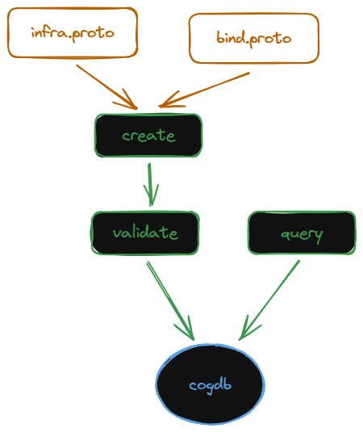
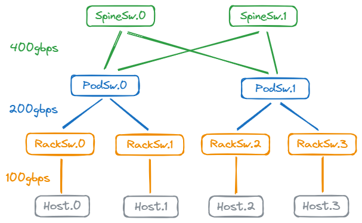

# Infrastructure as a Graph

Create infrastructure as a graph using messages from infra.proto. The messages allow a user to easily create logical infrastructure as vertexes and edges and scale it up and scale it out without duplicating content.

Submit it to the infrastructure `create` API to validate and store the data in a cogdb inmemory data store.

Use the `query` api to find paths from npu to npu.



Given the following logical `3 tier fabric`



the following steps illustrate how to create infrastructure as a graph consisting of `dgxa100` and `tomahawk3` devices as hosts and switches:

- [Create devices](#create-a-device-inventory)
- [Scale out the devices](#create-device-instances)
- [Connect the devices](#connect-device-instances)
- [Optionally extend the graph](#extending-infrastructure-as-a-graph)
- [Validate the graph](#validate-the-infrastructure)
- [Query the graph](#query-the-infrastructure)

## Create a Device Inventory

A device inventory is designed to define the device components, links and connections once and that device can subsequently be reused in a `DeviceInstance` message to scale out the device under different names.

> Note that the entire device does not need to be described in full detail. The level of device detail should be dictated by the needs of the application.

- use the `Component` message to define individual components (vertexes) that are present in a device
- use the `Component.count` field to scale up the number of components in the device
- use the `Link` message to define different links within the device
- use the `Device` message to contain `Component` and `Link` messages
- use the `Device.connections` field to connect components (vertexes) to each other with an associated link to form an edge
  - the format of a `connections` string is described in the infra.proto file

### DgxA100 device

```yaml
infrastructure:
  inventory:
    devices:
      - name: dgxa100
        components:
          - name: a100
            count: 8
            npu:
              memory:
          - name: nvsw
            count: 6
            switch:
              nvswitch:
          - name: nic
            count: 8
            nic:
              ethernet:
          - name: pciesw
            count: 4
            switch:
              pcie:
    links:
      - name: nvlink
        description: NVLink 3.0, 25GBs/50GBs bidirectional
        bandwidth:
          gBs: 50
      - name: pcie
        description: PCI Express x16 (gen 4.0)
        bandwidth:
          gBs: 24.7
    connections:
      - a100.[:].nvlink.nvsw.[:].MTM
      - a100.[0:1].pcie.pciesw.0.MTO
      - nic.[0:1].pcie.pciesw.0.MTO
```

### Tomahawk3 device

```yaml
infrastructure:
  inventory:
    devices:
      - name: th3
        components:
          - name: asic
            count: 1
            custom:
              memory:
          - name: nic
            count: 32
            nic:
              ethernet:
    links:
      - name: mii
        custom:
          bandwidth:
    connections:
      - nic.[:].mii.asic.0
```

## Create Device Instances

Scale out the infrastructure by using the `DeviceInstance` message and appending instances of them to the `Infrastructure.device_instances` field.

- the `DeviceInstance.name` field is a unique key that enables reuse of device inventory under different names
- the `DeviceInstance.device` field is a name that must exist in the `Infrastructure.inventory.devices` map key

```yaml
infrastructure:
  device_instances:
    - name: host
      device: dgxa100
      count: 4
    - name: racksw
      device: th3
      count: 4
    - name: podsw
      device: th3
      count: 2
    - name: spinesw
      device: th3
      count: 2
```

## Connect Device Instances

Connect device instances using the `Infrastructure.connections` field to create the `3 tier fabric` as a graph.

```yaml
infrastructure:
  connections:
    - host.0.nic.[0:8].eth.racksw.0.nic.[0:8].OTO
    - host.1.nic.[0:8].eth.racksw.0.nic.[0:8].OTO
    - host.2.nic.[0:8].eth.racksw.0.nic.[0:8].OTO
    - host.3.nic.[0:8].eth.racksw.0.nic.[0:8].OTO
    - racksw.0.nic.[8:11].eth.podsw.0.nic.[0:8].OTO
    - racksw.1.nic.[8:11].eth.podsw.0.nic.[0:8].OTO
    - racksw.2.nic.[8:11].eth.podsw.1.nic.[0:8].OTO
    - racksw.3.nic.[8:11].eth.podsw.1.nic.[0:8].OTO
```

## Extending Infrastructure as a Graph

Use the Bindings message in bind.proto to extend the logical infrastructure by adding any data that is outside the scope of the graph.

This is done by binding logical endpoints to any data such as:

### type meta data

```yaml
bindings:
  - infrastructure:
    data:
      name: DeviceTypes
      description: Key value metadata map of a user specified device type to an infrastructure inventory device name
      value:
      - @type: type.googleapis.com/google.protobuf.Struct
      - device_types:
        - key: host
          value: dgxa100
        - key: switch
          value: th3
```

### physical configuration

```yaml

```

### application

```yaml

```

## Validate the Infrastructure

Explodes any connection shortcuts and validates the overall graph to ensure referential integrity.

## Query the Infrastructure

Use queries to extract paths.
