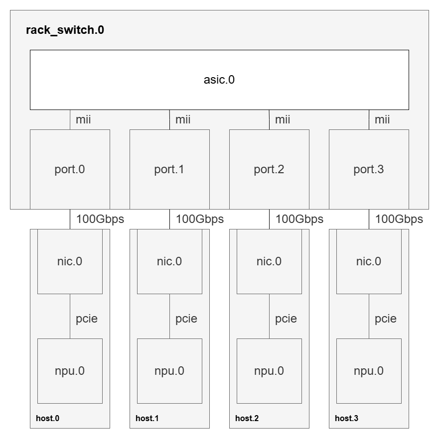

# Infrastructure as a Graph

Create infrastructure as a graph using messages from [infra.proto](keysight_chakra/infra/infra.proto). The messages allow a user to easily create logical infrastructure as vertexes and edges and scale it up and scale it out without duplicating content. The infra.proto is a Protocol Buffers (Protobuf) message that serves as the core data model for defining and designing the infrastructure. Protobuf is a schema-based, strongly typed format that models data as messages with defined fields and types in a .proto file. This schema enables efficient serialization and deserialization of structured data.

While Protobuf itself uses a compact binary format, the data defined by the Protobuf message can be converted to more human-readable formats such as JSON and YAML. This conversion facilitates easier inspection, configuration, and integration with tools that prefer text-based formats.

In this README, we have extensively used YAML in the examples above due to its readability and suitability for configuration and data serialization tasks. YAML's clear syntax for nested structures and lists makes it an excellent complement to the Protobuf-defined data model.

## Lets Build Infrastructure

The idea is to build infrastructure using our infra.proto data model. The main steps in desiging a network infrastructure using infra.proto is as follows:

- Define the inventory: Here we define the devices and the external links
  - Defining Devices: Here we define a single device, its components and links inside
    - Define Component
    - Define Links
    - Create Connection between Components using Links
  - Defining Links: Here we define the external links connecting two devices
- Instantiating devices: The idea is that each device defined in the Inventory is a blueprint which can be instantiated into multiple copies.
- Defining Connections: Creating connections between device instances. As we provide a count of device instances, we can instantiate them with range

The steps below will guide you in designing a simple network infrastructure having 4 hosts and a single switch which will act as the ToR switch. For simplicity, we will be using a hypothetical Generic Switch and Host architecture having minimal components. With this example, you can scale up and scale out to create your own Network Data Center.

### Building Infrastructure: Creating Device Inventory

Device inventory is designed to define the device: components and links associated with a device which can be instantiated as device instances. This acts as a class or a blueprint whose objects/instances can be created and connected. The main motivation is to define once and use at multiple places. This is to optimize the infrastructure in terms of space complexity.

> Note that the entire device does not need to be described in full detail. The level of device detail should be dictated by the needs of the application.

To define a Device:

- use the `Component` message to define individual components (vertexes) that are present in a device
- use the `Component - count` field to scale up the number of components in the device
- use the `Link` message to define different links within the device
- use the `Device` message to contain `Component` and `Link` messages
- use the `Device - connections` field to connect components (vertexes) to each other with an associated link to form an edge
  - the format of a `connections` string is described in the infra.proto file

Now we will be designing a 4 port generic switch and a single nic host as a part of device inventory.

#### Building Infrastructure: Design a 4 port Generic Switch

Lets define a Generic Switch. Since its a simple switch, we can define two major components inside it:

- nic
- asic

These are the components present inside the switch. We can think of these components as graphs which are connected to each other through an edge. Let's define the Generic Switch Device:

```yaml
inventory:
  devices:
    generic_switch:
      components:
        asic:
          count: 1
          cpu:
            memory: MEM_RAM
          name: asic
        port:
          count: 4
          name: port
          nic:
            ethernet: {}
      connections:
        - port.0.mii.asic.0
        - port.1.mii.asic.0
        - port.2.mii.asic.0
        - port.3.mii.asic.0
      links:
        mii:
          name: mii
      name: generic_switch
```

Here, we have defined a generic_switch with two components: asic with a count of 1 and port with a count of 4. Once the components are defined, we can define connection between component with three parts:

- Source Part
- Link
- Destination Part

The source part contains the source component and its index. The destination part is analogous to the source part and concerns itself with the destination component. The link joins the source part and the destination part. Therefore, the connection would look something like this:

```
source_component -- source_component_index -- link -- destination_component -- destination_component_index
```

This has been defined in the connections section of the device: generic_switch. The link is defined in the links section of the generic_switch.

Visualizing the generic_switch device (from the yaml definition):


#### Building Infrastructure: Design a single nic Generic Host

Let's design the Generic Host in a similar manner as we designed Generic Switch. Our Generic Host has two components:

- nic
- npu

In this host, each nic is connected to an npu. Again we can think of these components as graphs which are connected to each other through an edge or pcie in our case. The links and connections are defined in the links and connections section respectively. Let's define the Generic Host:

```yaml
inventory:
  devices:
    generic_host:
      components:
        nic:
          count: 1
          name: nic
          nic:
            ethernet: {}
        npu:
          count: 1
          name: npu
          npu:
            memory: MEM_UNSPECIFIED
      connections:
        - npu.0.pcie.nic.0
      links:
        pcie:
          name: pcie
      name: generic_host
```

Visual representation of generic_host:


### Building Infrastructure: Defining the Links

In this section, we define the links interconnecting the device. In our example, we would be connected each host to the switch with a 100 Gbps link. We can define the link in the following manner:

```yaml
links:
  100Gbps:
    bandwidth:
      gbps: 100
    description: 100 Gbps ethernet link.
    name: 100Gbps
```

Here, we have defined the link with the name: 100Gbps which has a bandwidth set to a 100 gbps. This will be used in connecting two devices together.

### Building Infrastructure: Creating Device Instances:

We can scale out the infrastructure by using the `device instance` message. In our example, we would want to connect 4 generic_host to the generic_switch which we have defined. The idea is to instantiate each of them with a count, so to instantiate 4 `generic_host` as `host`, we can define the data model as:

```yaml
device_instances:
  host:
    count: 4
    device: generic_host
    name: host
```

Similarly to instantiate the `generic_switch` as a `rack_switch`, we can define the instance as:

```yaml
device_instances:
  rack_switch:
    count: 1
    device: generic_switch
    name: rack_switch
```

Together, the `device instance` section looks like this:

```yaml
device_instances:
  host:
    count: 4
    device: generic_host
    name: host
  rack_switch:
    count: 1
    device: generic_switch
    name: rack_switch
```

The idea is that we have defined the devices under `inventory - devices` section, which acts as a blueprint. We need to instantiate them - like the way we create objects of a class. With the count specified, it creates multiple copies of the devices starting from index 0. A quick visual of the `device instances` would looke like this:


Now we need to connect these device instances together.

### Building Infrastructure: Connecting Device Instances

Connections between the devices are made by the components of the device and links defined. Therefore, to connect two devices together, we need to define the connection with three major parts:

- Source Device Part
- Link
- Destination Device Part

The source device part contains the source device, index of the device, component within the device, and the index of the component. The destination device part is analogous to the source device part but mainly deals with the destination aspect of the connection. The Link mainly defines the link between these two parts. Therefore a connection would look like this:

```
source_device -- source_device_index -- source_component -- source_component_index -- link -- destination_device -- destination_device_index -- destination_component -- destination_component_index
```

Our data model gives the flexibility to define these connections. A "." separator is used to separate between two infrastructure elements. Now to connect a `host` with the `rack_switch` we can define the connection as:

```yaml
connections:
  - host.0.nic.0.100Gbps.rack_switch.0.port.0
```

This means that the host at index 0, having a source component 0 is connected to port 0 of rack_switch at index 0

Visualizing the above connection:


Scaling up the connections, we would get the connection section as:

```yaml
connections:
  - host.0.nic.0.100Gbps.rack_switch.0.port.0
  - host.1.nic.0.100Gbps.rack_switch.0.port.1
  - host.2.nic.0.100Gbps.rack_switch.0.port.2
  - host.3.nic.0.100Gbps.rack_switch.0.port.3
```

Visualizing the graph:



## Building Infrastructure: Complete Definition:

After combining all the definitions, we can arrive at the final design:

```yaml
connections:
  - host.0.nic.0.100Gbps.rack_switch.0.port.0
  - host.1.nic.0.100Gbps.rack_switch.0.port.1
  - host.2.nic.0.100Gbps.rack_switch.0.port.2
  - host.3.nic.0.100Gbps.rack_switch.0.port.3
device_instances:
  host:
    count: 4
    device: generic_host
    name: host
  rack_switch:
    count: 1
    device: generic_switch
    name: rack_switch
inventory:
  devices:
    generic_host:
      components:
        nic:
          count: 1
          name: nic
          nic:
            ethernet: {}
        npu:
          count: 1
          name: npu
          npu:
            memory: MEM_UNSPECIFIED
      connections:
        - npu.0.pcie.nic.0
      links:
        pcie:
          name: pcie
      name: generic_host
    generic_switch:
      components:
        asic:
          count: 1
          cpu:
            memory: MEM_RAM
          name: asic
        port-down:
          count: 4
          name: port
          nic:
            ethernet: {}
      connections:
        - port.0.mii.asic.0
        - port.1.mii.asic.0
        - port.2.mii.asic.0
        - port.3.mii.asic.0
      links:
        mii:
          name: mii
      name: generic_switch
  links:
    100Gbps:
      bandwidth:
        gbps: 100
      description: 100 Gbps ethernet link.
      name: 100Gbps
```

## Extending Infrastructure as a Graph

The main intent of infra.proto is to define and design a network fabric. This allows end users to define the devices as nodes and links as edges. The data model also allows us to define and design devices by allowing us to add links and components present in the device. This also models the device internals as a graph and a subgraph if we look it from the whole infrastructure aspect.

Since the infra.proto allows us to define the network infrastructure, a new data model (annotate.proto) was necessary to allow and define various bindings which may be suitable to multiple usecases. This data model allows to add/bind/annotate various infrastructre elements. This allows to add:

- Vendor specific data
- More qualities of the infrastructure
- Attach certain device performance attributes, like: - Latency - Routing tables
  and helps add more context and content to infrastructure elements.

The core intent is to decouple various bindings with infrastructure, separating the concerns of desiging the infrastructure with additional data which may not be relevant to external usecases. This allows the ability to share the infrastructure without the worry and hassle to separate unwanted data or data.

Lets annotate device type to our previous example:

The idea is to add a `Device Type` to our infra devices with the types being `physical_switch`, `physical_host`, `vm_host`, `vm_switch`. This would provide some more insights on what the device type is. Annotating the infrastructure:

```yaml
- data:
    name: DeviceTypes
    value:
      "@type": type.googleapis.com/google.protobuf.ListValue
      value:
        - device_instance: host
          device_type: physical_host
        - device_instance: rack_Switch
          device_type: physical_switch
  targets:
    - infrastructure: Infrastructure
```

Here, we need to set the target and provide a value. The target is a list of elements defined in the infrastructure. Here we are applying it to the overall infrastructure and the value contains a special schema which defines the device_instance and associates it with a device_type.

> Note: The schema can be internal to an organization.

Another example is to define an `Open Config Interface` for our `rack_switch`:

```yaml
- data:
    name: OpenConfigInterface
    value:
      "@type": type.googleapis.com/google.protobuf.Struct
      value:
        config:
          - type: ...
          - mtu: ...
          - loopback-mode: ...
          - enabled: ...
  targets:
    - device_instance: rack_switch
```

## More Examples

More examples are located [here.](resources/infra_examples/)
